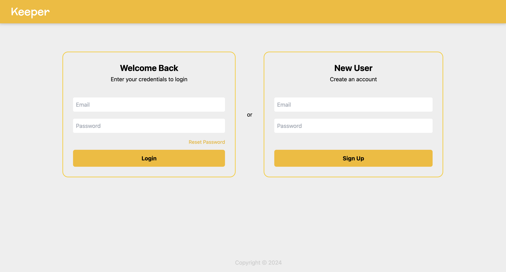
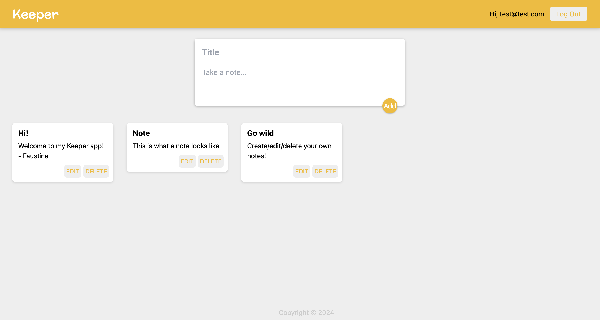

# Keeper App Frontend

## Technologies/Frameworks/Libraries

This project was bootstrapped with [Create React App](https://github.com/facebook/create-react-app).

Authentication implemented through Firebase Auth.

API calls made through Axios.

CSS Framework: Tailwind CSS (installation and usage guide: https://tailwindcss.com/docs/installation)

## How to Run Locally

**Requirements:**

- Node.js installed (If not download it [here](https://nodejs.org/en/download/)).

### Setup

To install the dependencies listed in `package.json`, run `npm install`.

Create a `.env` file in the project directory containing the following keys:

- `REACT_APP_LOCAL`: “true” if the backend is running locally and “false” if connecting to the deployed backend

- `REACT_APP_APIKEY`, `REACT_APP_AUTHDOMAIN`, `REACT_APP_PROJECTID`, `REACT_APP_STORAGEBUCKET`, `REACT_APP_MESSAGINGSENDERID`, `REACT_APP_APPID`: All are the corresponding values used for Firebase Auth

(Already created in the repo for grading purposes)

In the project directory, you can run:

### `npm start`

Runs the app in the development mode.
Open [http://localhost:3000](http://localhost:3000/) to view it in your browser.

The page will reload when you make changes.
You may also see any lint errors in the console.

### `npm test`

Launches the test runner in the interactive watch mode.
See the section about [running tests](https://facebook.github.io/create-react-app/docs/running-tests) for more information.

### `npm run build`

Builds the app for production to the `build` folder.
It correctly bundles React in production mode and optimizes the build for the best performance.

The build is minified and the filenames include the hashes.
Your app is ready to be deployed!

See the section about [deployment](https://facebook.github.io/create-react-app/docs/deployment) for more information.

### `npm run eject`

**Note: this is a one-way operation. Once you `eject`, you can't go back!**

If you aren't satisfied with the build tool and configuration choices, you can `eject` at any time. This command will remove the single build dependency from your project.

Instead, it will copy all the configuration files and the transitive dependencies (webpack, Babel, ESLint, etc) right into your project so you have full control over them. All of the commands except `eject` will still work, but they will point to the copied scripts so you can tweak them. At this point you're on your own.

You don't have to ever use `eject`. The curated feature set is suitable for small and middle deployments, and you shouldn't feel obligated to use this feature. However we understand that this tool wouldn't be useful if you couldn't customize it when you are ready for it.

## Deployment

Deployed on Vercel: https://keeper-fc.vercel.app/

Video Demo: https://youtu.be/ry--s5_ghmg

## Functionality

This is a web app that is used to create and store notes. Users need to sign up and log in with their emails to access their private notes.

Passwords need to have at least 6 characters and emails already registered cannot be used to create new accounts. If the user has forgotten their password, a password reset can be requested through the “Reset Password” link, which will send a password reset link to the email entered in the “Email” input box if it matches a registered user’s email.

Notes can be created, modified, and deleted.

Feel free to sign up for your own account or use the test account:

Email: test@test.com Password: testtest

## Acknowledgements

- Professor Shoaib Ahamed and all the TA’s of COMS 3102 (Shivam, Raghad, and Ahmed)
- Shivam Shekhar’s walkthrough
- WebDecoded’s Video: https://www.youtube.com/watch?v=Vv_Oi7zPPTw&ab_channel=webdecoded on implementing Firebase Auth

## Author

Faustina Cheng